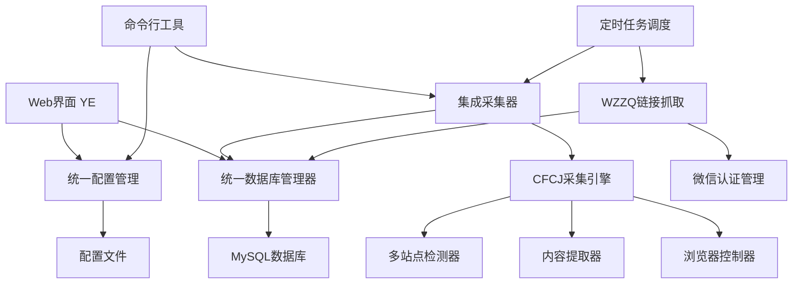

# WZ内容管理系统 - 项目文档

## 📋 目录

- [项目概述](#项目概述)
- [系统架构](#系统架构)
- [模块详述](#模块详述)
- [数据库设计](#数据库设计)
- [配置管理](#配置管理)
- [安装部署](#安装部署)
- [使用指南](#使用指南)
- [API文档](#api文档)
- [故障排查](#故障排查)
- [维护指南](#维护指南)

## 📖 项目概述

### 项目简介

WZ内容管理系统是一个多站点内容采集和管理平台，主要功能包括：

- **多源内容采集**：支持微信公众号、Linux.do、NodeSeek等多个平台的内容采集
- **统一数据管理**：提供统一的数据库架构和管理接口
- **智能内容处理**：自动提取文章标题、内容、图片等信息
- **状态跟踪管理**：完整的采集状态和发布状态跟踪
- **配置化管理**：灵活的配置管理系统，支持多环境部署

### 技术栈

- **后端语言**: Python 3.8+
- **数据库**: MySQL 8.0+
- **Web框架**: Flask
- **浏览器自动化**: DrissionPage
- **数据库连接**: mysql-connector-python
- **任务调度**: APScheduler
- **日志系统**: Python logging

### 版本信息

- **当前版本**: v1.0.0
- **发布日期**: 2025-07-09
- **维护状态**: 活跃开发中

## 🏗️ 系统架构

### 整体架构图

```
┌─────────────────────────────────────────────────────────────────┐
│                        WZ内容管理系统                            │
├─────────────────────────────────────────────────────────────────┤
│                        用户界面层                               │
├─────────────────┬───────────────┬───────────────┬─────────────────┤
│   Web管理界面   │   命令行工具   │   API接口     │   定时任务       │
│     (YE)       │(main_integrated)│              │                │
└─────────────────┴───────────────┴───────────────┴─────────────────┘
┌─────────────────────────────────────────────────────────────────┐
│                        业务逻辑层                               │
├─────────────────┬───────────────┬───────────────┬─────────────────┤
│   链接管理      │   内容采集     │   集成采集器   │   认证管理       │
│   (WZZQ)       │   (CFCJ)      │(IntegratedCrawler)│(wechat_mp_auth)│
└─────────────────┴───────────────┴───────────────┴─────────────────┘
┌─────────────────────────────────────────────────────────────────┐
│                        数据访问层                               │
├─────────────────┬───────────────┬───────────────┬─────────────────┤
│   统一数据库     │   配置管理     │   日志系统     │   文件存储       │
│   管理器        │   (Config)    │   (Logging)   │   (Files)       │
└─────────────────┴───────────────┴───────────────┴─────────────────┘
┌─────────────────────────────────────────────────────────────────┐
│                        基础设施层                               │
├─────────────────┬───────────────┬───────────────┬─────────────────┤
│   MySQL数据库   │   文件系统     │   Chrome浏览器 │   网络服务       │
└─────────────────┴───────────────┴───────────────┴─────────────────┘
```

### 核心组件关系



### 数据流向图

```
用户操作 → Web界面/命令行 → 业务逻辑层 → 数据访问层 → 数据库
    ↓
链接获取 → WZZQ模块 → 微信认证 → 存储链接到数据库
    ↓
内容采集 → 集成采集器 → CFCJ引擎 → 提取内容 → 更新数据库
    ↓
状态管理 → 统一数据库管理器 → 状态跟踪 → 日志记录
```

## 📦 模块详述

### 1. YE模块 - Web管理界面

**位置**: `wz/YE/`

**功能描述**:
- 提供Web界面管理功能
- 支持手动触发采集任务
- 显示系统状态和统计信息
- 管理定时任务调度

**主要文件**:
- `app.py` - Flask应用主程序
- `templates/` - HTML模板文件
- `static/` - 静态资源文件

**核心功能**:
```python
# 主要路由
@app.route('/')           # 首页
@app.route('/crawl')      # 立即抓取
@app.route('/articles')   # 文章列表
@app.route('/logs')       # 日志查看
@app.route('/config')     # 配置管理
```

### 2. WZZQ模块 - 微信链接抓取

**位置**: `wz/wzzq/`

**功能描述**:
- 微信公众号文章链接自动抓取
- 支持多个公众号批量处理
- 自动去重和状态管理

**主要文件**:
- `main.py` - 主程序入口
- `wechat_crawler.py` - 微信爬虫核心逻辑
- `db.py` - 数据库操作

**核心功能**:
```python
class WechatCrawler:
    def crawl_account_articles(self, account_name, limit=20)
    def get_account_fakeid(self, account_name)
    def fetch_article_list(self, fakeid, count=5)
```

### 3. CFCJ模块 - 多站点内容采集

**位置**: `wz/cfcj/`

**功能描述**:
- 支持多个网站的内容采集
- 自动检测站点类型和采集规则
- Cloudflare防护绕过
- 结构化内容提取

**主要文件**:
- `api.py` - 对外API接口
- `core/crawler.py` - 爬虫核心引擎
- `core/multi_site_extractor.py` - 多站点内容提取器
- `core/site_detector.py` - 站点类型检测器

**支持的站点**:
- Linux.do
- NodeSeek
- 微信公众号
- 通用网站（基础提取）

### 4. wechat_mp_auth模块 - 微信认证管理

**位置**: `wz/wechat_mp_auth/`

**功能描述**:
- 微信公众平台登录状态管理
- 自动登录和会话保持
- Cookie和Token管理

**主要文件**:
- `auth.py` - 认证核心逻辑
- `config.py` - 认证配置

### 5. 核心模块 - 统一管理层

**位置**: `wz/core/`

**功能描述**:
- 提供统一的数据库管理
- 统一的配置管理
- 集成采集器

**主要文件**:
- `database.py` - 统一数据库管理器
- `config.py` - 统一配置管理
- `integrated_crawler.py` - 集成采集器

## 🗄️ 数据库设计

### 数据库架构

数据库名称: `cj`

### 主要数据表

#### 1. articles - 统一文章管理表

```sql
CREATE TABLE `articles` (
  `id` BIGINT UNSIGNED NOT NULL AUTO_INCREMENT COMMENT '文章唯一ID',
  `source_type` ENUM('wechat', 'linux_do', 'nodeseek', 'external') NOT NULL COMMENT '来源类型',
  `source_name` VARCHAR(255) NOT NULL COMMENT '来源名称（公众号名/网站名）',
  `source_id` VARCHAR(255) DEFAULT NULL COMMENT '来源平台的文章ID',
  `title` VARCHAR(512) NOT NULL COMMENT '文章标题',
  `article_url` VARCHAR(1024) NOT NULL COMMENT '文章原始链接',
  `author` VARCHAR(255) DEFAULT NULL COMMENT '作者',
  `publish_timestamp` DATETIME DEFAULT NULL COMMENT '文章发布时间',
  `crawl_status` ENUM('pending', 'crawling', 'completed', 'failed', 'skipped') DEFAULT 'pending' COMMENT '采集状态',
  `crawl_attempts` INT UNSIGNED DEFAULT 0 COMMENT '采集尝试次数',
  `crawl_error` TEXT DEFAULT NULL COMMENT '采集错误信息',
  `crawled_at` TIMESTAMP NULL DEFAULT NULL COMMENT '采集完成时间',
  `content` LONGTEXT DEFAULT NULL COMMENT '文章纯文本内容',
  `content_html` LONGTEXT DEFAULT NULL COMMENT '文章HTML内容',
  `word_count` INT UNSIGNED DEFAULT 0 COMMENT '文章字数',
  `images` JSON DEFAULT NULL COMMENT '文章图片信息',
  `links` JSON DEFAULT NULL COMMENT '文章链接信息',
  `tags` JSON DEFAULT NULL COMMENT '文章标签',
  `ai_title` VARCHAR(512) DEFAULT NULL COMMENT 'AI改写后的标题',
  `ai_content` LONGTEXT DEFAULT NULL COMMENT 'AI改写后的内容',
  `ai_summary` TEXT DEFAULT NULL COMMENT 'AI生成的摘要',
  `publish_status` JSON DEFAULT NULL COMMENT '发布状态',
  `fetched_at` TIMESTAMP DEFAULT CURRENT_TIMESTAMP COMMENT '链接获取时间',
  `updated_at` TIMESTAMP DEFAULT CURRENT_TIMESTAMP ON UPDATE CURRENT_TIMESTAMP COMMENT '最后更新时间',
  `created_at` TIMESTAMP DEFAULT CURRENT_TIMESTAMP COMMENT '记录创建时间',
  
  PRIMARY KEY (`id`),
  UNIQUE KEY `uk_source_url` (`source_type`, `article_url`(255)),
  INDEX `idx_source_type` (`source_type`),
  INDEX `idx_source_name` (`source_name`),
  INDEX `idx_crawl_status` (`crawl_status`),
  INDEX `idx_publish_timestamp` (`publish_timestamp`),
  INDEX `idx_crawled_at` (`crawled_at`),
  INDEX `idx_fetched_at` (`fetched_at`)
) ENGINE=InnoDB DEFAULT CHARSET=utf8mb4 COLLATE=utf8mb4_unicode_ci COMMENT='统一文章管理表';
```

#### 2. publish_tasks - 发布任务管理表

```sql
CREATE TABLE `publish_tasks` (
  `id` BIGINT UNSIGNED NOT NULL AUTO_INCREMENT COMMENT '任务ID',
  `article_id` BIGINT UNSIGNED NOT NULL COMMENT '关联文章ID',
  `target_platform` ENUM('8wf_net', '00077_top', '1rmb_net') NOT NULL COMMENT '目标平台',
  `target_forum_id` VARCHAR(100) DEFAULT NULL COMMENT '目标版块ID',
  `target_category` VARCHAR(255) DEFAULT NULL COMMENT '目标分类',
  `status` ENUM('pending', 'processing', 'completed', 'failed', 'cancelled') DEFAULT 'pending' COMMENT '任务状态',
  `priority` TINYINT UNSIGNED DEFAULT 5 COMMENT '优先级(1-10, 数字越小优先级越高)',
  `attempts` INT UNSIGNED DEFAULT 0 COMMENT '尝试次数',
  `max_attempts` INT UNSIGNED DEFAULT 3 COMMENT '最大尝试次数',
  `published_url` VARCHAR(1024) DEFAULT NULL COMMENT '发布后的URL',
  `published_id` VARCHAR(255) DEFAULT NULL COMMENT '发布后的帖子ID',
  `error_message` TEXT DEFAULT NULL COMMENT '错误信息',
  `response_data` JSON DEFAULT NULL COMMENT '发布响应数据',
  `custom_title` VARCHAR(512) DEFAULT NULL COMMENT '自定义标题',
  `custom_content` LONGTEXT DEFAULT NULL COMMENT '自定义内容',
  `publish_config` JSON DEFAULT NULL COMMENT '发布配置',
  `scheduled_at` TIMESTAMP NULL DEFAULT NULL COMMENT '计划发布时间',
  `started_at` TIMESTAMP NULL DEFAULT NULL COMMENT '开始处理时间',
  `completed_at` TIMESTAMP NULL DEFAULT NULL COMMENT '完成时间',
  `created_at` TIMESTAMP DEFAULT CURRENT_TIMESTAMP COMMENT '创建时间',
  `updated_at` TIMESTAMP DEFAULT CURRENT_TIMESTAMP ON UPDATE CURRENT_TIMESTAMP COMMENT '更新时间',
  
  PRIMARY KEY (`id`),
  FOREIGN KEY (`article_id`) REFERENCES `articles`(`id`) ON DELETE CASCADE,
  INDEX `idx_article_id` (`article_id`),
  INDEX `idx_target_platform` (`target_platform`),
  INDEX `idx_status` (`status`),
  INDEX `idx_priority` (`priority`),
  INDEX `idx_scheduled_at` (`scheduled_at`),
  INDEX `idx_created_at` (`created_at`)
) ENGINE=InnoDB DEFAULT CHARSET=utf8mb4 COLLATE=utf8mb4_unicode_ci COMMENT='发布任务管理表';
```

#### 3. system_config - 系统配置管理表

```sql
CREATE TABLE `system_config` (
  `id` INT UNSIGNED NOT NULL AUTO_INCREMENT COMMENT '配置ID',
  `config_key` VARCHAR(100) NOT NULL COMMENT '配置键',
  `config_value` JSON NOT NULL COMMENT '配置值',
  `config_type` ENUM('system', 'crawler', 'publisher', 'auth', 'user') DEFAULT 'system' COMMENT '配置类型',
  `description` TEXT DEFAULT NULL COMMENT '配置描述',
  `is_active` BOOLEAN DEFAULT TRUE COMMENT '是否启用',
  `created_at` TIMESTAMP DEFAULT CURRENT_TIMESTAMP COMMENT '创建时间',
  `updated_at` TIMESTAMP DEFAULT CURRENT_TIMESTAMP ON UPDATE CURRENT_TIMESTAMP COMMENT '更新时间',
  
  PRIMARY KEY (`id`),
  UNIQUE KEY `uk_config_key` (`config_key`),
  INDEX `idx_config_type` (`config_type`),
  INDEX `idx_is_active` (`is_active`)
) ENGINE=InnoDB DEFAULT CHARSET=utf8mb4 COLLATE=utf8mb4_unicode_ci COMMENT='系统配置管理表';
```

### 数据表关系图

```
articles (1) ←→ (N) publish_tasks
    ↓
system_config (配置管理)
    ↓
auth_credentials (认证信息)
    ↓
operation_logs (操作日志)
```

### 字段说明

#### articles表关键字段

- `source_type`: 内容来源类型
  - `wechat`: 微信公众号
  - `linux_do`: Linux.do论坛
  - `nodeseek`: NodeSeek论坛
  - `external`: 外部导入

- `crawl_status`: 采集状态
  - `pending`: 待采集
  - `crawling`: 采集中
  - `completed`: 采集完成
  - `failed`: 采集失败
  - `skipped`: 跳过采集

- `publish_status`: 发布状态（JSON格式）
  ```json
  {
    "8wf_net": "completed",
    "00077_top": "pending",
    "1rmb_net": "failed"
  }
  ```

#### publish_tasks表关键字段

- `target_platform`: 目标发布平台
  - `8wf_net`: 8wf.net论坛
  - `00077_top`: 00077.top论坛
  - `1rmb_net`: 1rmb.net论坛

- `status`: 任务状态
  - `pending`: 待处理
  - `processing`: 处理中
  - `completed`: 已完成
  - `failed`: 失败
  - `cancelled`: 已取消

## ⚙️ 配置管理

### 配置文件结构

系统使用统一的JSON配置文件，支持多环境配置：

```
wz/config/
├── config.json          # 默认配置
├── config.dev.json      # 开发环境配置
├── config.prod.json     # 生产环境配置
└── config.json.template # 配置模板
```

### 配置文件示例

```json
{
  "system": {
    "project_name": "WZ Content Management System",
    "version": "1.0.0",
    "debug": false,
    "log_level": "INFO",
    "data_dir": "data",
    "logs_dir": "logs",
    "temp_dir": "temp",
    "timezone": "Asia/Shanghai",
    "language": "zh_CN"
  },
  "database": {
    "host": "140.238.201.162",
    "port": 3306,
    "user": "cj",
    "password": "760516",
    "database": "cj",
    "charset": "utf8mb4",
    "autocommit": true,
    "pool_size": 10,
    "max_overflow": 20,
    "pool_timeout": 30,
    "pool_recycle": 3600
  },
  "wechat": {
    "enabled": true,
    "batch_size": 10,
    "retry_times": 3,
    "retry_delay": 5,
    "request_delay": 2,
    "auto_login": true,
    "session_timeout": 3600,
    "cookie_file": "id_info.json",
    "accounts_file": "name2fakeid.json"
  },
  "cfcj": {
    "enabled": true,
    "headless": true,
    "window_size": [1920, 1080],
    "timeout": 30,
    "page_load_timeout": 60,
    "implicit_wait": 10,
    "max_retries": 3,
    "retry_delay": 5,
    "cf_wait_time": 10,
    "request_delay": 2,
    "batch_size": 5,
    "user_agent": "Mozilla/5.0 (Windows NT 10.0; Win64; x64) AppleWebKit/537.36"
  },
  "publisher": {
    "enabled": false,
    "auto_publish": false,
    "batch_size": 5,
    "retry_times": 3,
    "retry_delay": 10,
    "platforms": {
      "8wf_net": {
        "enabled": false,
        "type": "discuz",
        "url": "https://8wf.net",
        "username": "",
        "password": "",
        "default_forum_id": "1",
        "auto_category": true
      },
      "00077_top": {
        "enabled": false,
        "type": "discourse",
        "url": "https://00077.top",
        "api_key": "",
        "api_username": "",
        "default_category": "1"
      },
      "1rmb_net": {
        "enabled": false,
        "type": "discuz",
        "url": "https://1rmb.net",
        "username": "",
        "password": "",
        "default_forum_id": "1",
        "auto_category": true
      }
    }
  },
  "web": {
    "host": "0.0.0.0",
    "port": 5000,
    "debug": false,
    "secret_key": "wz_project_secret_key_change_in_production",
    "auto_crawl_interval": 3600,
    "max_log_size": 5242880,
    "log_backup_count": 3
  }
}
```

### 配置参数说明

#### system 系统配置
- `project_name`: 项目名称
- `version`: 版本号
- `debug`: 调试模式开关
- `log_level`: 日志级别 (DEBUG, INFO, WARNING, ERROR)
- `data_dir`: 数据文件目录
- `logs_dir`: 日志文件目录
- `temp_dir`: 临时文件目录
- `timezone`: 时区设置
- `language`: 语言设置

#### database 数据库配置
- `host`: 数据库主机地址
- `port`: 数据库端口
- `user`: 数据库用户名
- `password`: 数据库密码
- `database`: 数据库名称
- `charset`: 字符集
- `autocommit`: 自动提交事务
- `pool_size`: 连接池大小
- `max_overflow`: 最大溢出连接数
- `pool_timeout`: 连接超时时间
- `pool_recycle`: 连接回收时间

#### wechat 微信配置
- `enabled`: 是否启用微信采集
- `batch_size`: 批量处理大小
- `retry_times`: 重试次数
- `retry_delay`: 重试延迟（秒）
- `request_delay`: 请求间隔（秒）
- `auto_login`: 自动登录开关
- `session_timeout`: 会话超时时间
- `cookie_file`: Cookie文件名
- `accounts_file`: 账号配置文件名

#### cfcj 内容采集配置
- `enabled`: 是否启用CFCJ采集
- `headless`: 无头浏览器模式
- `window_size`: 浏览器窗口大小
- `timeout`: 页面超时时间
- `page_load_timeout`: 页面加载超时
- `implicit_wait`: 隐式等待时间
- `max_retries`: 最大重试次数
- `retry_delay`: 重试延迟
- `cf_wait_time`: Cloudflare等待时间
- `request_delay`: 请求延迟
- `batch_size`: 批量处理大小
- `user_agent`: 用户代理字符串

#### publisher 发布配置
- `enabled`: 是否启用发布功能
- `auto_publish`: 自动发布开关
- `batch_size`: 批量发布大小
- `retry_times`: 发布重试次数
- `retry_delay`: 发布重试延迟
- `platforms`: 各平台配置详情

#### web Web界面配置
- `host`: 监听主机地址
- `port`: 监听端口
- `debug`: Web调试模式
- `secret_key`: Flask密钥（生产环境必须修改）
- `auto_crawl_interval`: 自动采集间隔
- `max_log_size`: 最大日志文件大小
- `log_backup_count`: 日志备份数量

## 🚀 安装部署

### 系统要求

#### 硬件要求
- **CPU**: 2核心以上
- **内存**: 4GB以上
- **存储**: 20GB以上可用空间
- **网络**: 稳定的互联网连接

#### 软件要求
- **操作系统**: Windows 10/11, Ubuntu 18.04+, CentOS 7+
- **Python**: 3.8 或更高版本
- **MySQL**: 8.0 或更高版本
- **Chrome浏览器**: 最新版本（用于内容采集）

### 安装步骤

#### 1. 环境准备

**安装Python**
```bash
# Ubuntu/Debian
sudo apt update
sudo apt install python3 python3-pip python3-venv

# CentOS/RHEL
sudo yum install python3 python3-pip

# Windows
# 从 https://python.org 下载并安装 Python 3.8+
```

**安装MySQL**
```bash
# Ubuntu/Debian
sudo apt install mysql-server mysql-client

# CentOS/RHEL
sudo yum install mysql-server mysql

# Windows
# 从 https://dev.mysql.com/downloads/mysql/ 下载并安装
```

**安装Chrome浏览器**
```bash
# Ubuntu/Debian
wget -q -O - https://dl.google.com/linux/linux_signing_key.pub | sudo apt-key add -
sudo sh -c 'echo "deb [arch=amd64] http://dl.google.com/linux/chrome/deb/ stable main" >> /etc/apt/sources.list.d/google-chrome.list'
sudo apt update
sudo apt install google-chrome-stable

# CentOS/RHEL
sudo yum install -y wget
wget https://dl.google.com/linux/direct/google-chrome-stable_current_x86_64.rpm
sudo yum localinstall google-chrome-stable_current_x86_64.rpm

# Windows
# 从 https://www.google.com/chrome/ 下载并安装
```

#### 2. 项目部署

**克隆项目**
```bash
# 如果使用Git
git clone <repository-url> wz-project
cd wz-project

# 或者直接解压项目文件到目标目录
```

**创建虚拟环境**
```bash
cd wz-project
python3 -m venv venv

# 激活虚拟环境
# Linux/Mac
source venv/bin/activate

# Windows
venv\Scripts\activate
```

**安装依赖**
```bash
# 安装Python依赖
pip install -r requirements.txt

# 如果没有requirements.txt，手动安装主要依赖
pip install flask mysql-connector-python drissionpage beautifulsoup4 lxml requests apscheduler
```

#### 3. 数据库配置

**创建数据库**
```sql
-- 登录MySQL
mysql -u root -p

-- 创建数据库
CREATE DATABASE cj CHARACTER SET utf8mb4 COLLATE utf8mb4_unicode_ci;

-- 创建用户（可选）
CREATE USER 'cj'@'localhost' IDENTIFIED BY 'your_password';
GRANT ALL PRIVILEGES ON cj.* TO 'cj'@'localhost';
FLUSH PRIVILEGES;
```

**初始化数据库表**
```bash
# 进入项目目录
cd wz

# 执行数据库初始化脚本
mysql -u cj -p cj < sql/001_unified_database_schema.sql
```

#### 4. 配置文件设置

**复制配置模板**
```bash
cd wz/config
cp config.json.template config.json
```

**编辑配置文件**
```bash
# 使用你喜欢的编辑器编辑配置
nano config.json
# 或
vim config.json
```

**关键配置项修改**:
- 修改数据库连接信息
- 设置Web界面密钥
- 配置日志路径
- 根据需要调整其他参数

#### 5. 运行配置迁移

```bash
# 运行配置迁移脚本
python scripts/migrate_config.py

# 运行数据库迁移脚本（如果有旧数据）
python scripts/migrate_database.py
```

#### 6. 启动服务

**启动Web界面**
```bash
cd wz/YE
python app.py
```

**使用集成命令行工具**
```bash
cd wz
python main_integrated.py status
```

#### 7. 验证安装

**运行集成测试**
```bash
cd wz
python test_integration.py
```

**检查系统状态**
```bash
python main_integrated.py status
```

### 生产环境部署

#### 使用Systemd服务（Linux）

**创建服务文件**
```bash
sudo nano /etc/systemd/system/wz-web.service
```

**服务配置内容**
```ini
[Unit]
Description=WZ Content Management System Web Service
After=network.target mysql.service

[Service]
Type=simple
User=www-data
WorkingDirectory=/path/to/wz-project/wz/YE
Environment=PATH=/path/to/wz-project/venv/bin
ExecStart=/path/to/wz-project/venv/bin/python app.py
Restart=always
RestartSec=10

[Install]
WantedBy=multi-user.target
```

**启动服务**
```bash
sudo systemctl daemon-reload
sudo systemctl enable wz-web.service
sudo systemctl start wz-web.service
sudo systemctl status wz-web.service
```

#### 使用Nginx反向代理

**安装Nginx**
```bash
sudo apt install nginx  # Ubuntu/Debian
sudo yum install nginx  # CentOS/RHEL
```

**配置Nginx**
```bash
sudo nano /etc/nginx/sites-available/wz-project
```

**Nginx配置内容**
```nginx
server {
    listen 80;
    server_name your-domain.com;

    location / {
        proxy_pass http://127.0.0.1:5000;
        proxy_set_header Host $host;
        proxy_set_header X-Real-IP $remote_addr;
        proxy_set_header X-Forwarded-For $proxy_add_x_forwarded_for;
        proxy_set_header X-Forwarded-Proto $scheme;
    }

    location /static {
        alias /path/to/wz-project/wz/YE/static;
        expires 30d;
    }
}
```

**启用配置**
```bash
sudo ln -s /etc/nginx/sites-available/wz-project /etc/nginx/sites-enabled/
sudo nginx -t
sudo systemctl reload nginx
```

### Docker部署（可选）

**创建Dockerfile**
```dockerfile
FROM python:3.9-slim

# 安装系统依赖
RUN apt-get update && apt-get install -y \
    wget \
    gnupg \
    unzip \
    curl \
    && rm -rf /var/lib/apt/lists/*

# 安装Chrome
RUN wget -q -O - https://dl.google.com/linux/linux_signing_key.pub | apt-key add - \
    && echo "deb [arch=amd64] http://dl.google.com/linux/chrome/deb/ stable main" >> /etc/apt/sources.list.d/google-chrome.list \
    && apt-get update \
    && apt-get install -y google-chrome-stable \
    && rm -rf /var/lib/apt/lists/*

# 设置工作目录
WORKDIR /app

# 复制项目文件
COPY . .

# 安装Python依赖
RUN pip install -r requirements.txt

# 暴露端口
EXPOSE 5000

# 启动命令
CMD ["python", "wz/YE/app.py"]
```

**创建docker-compose.yml**
```yaml
version: '3.8'

services:
  wz-app:
    build: .
    ports:
      - "5000:5000"
    environment:
      - PYTHONPATH=/app
    volumes:
      - ./wz/data:/app/wz/data
      - ./wz/logs:/app/wz/logs
    depends_on:
      - mysql

  mysql:
    image: mysql:8.0
    environment:
      MYSQL_ROOT_PASSWORD: rootpassword
      MYSQL_DATABASE: cj
      MYSQL_USER: cj
      MYSQL_PASSWORD: password
    volumes:
      - mysql_data:/var/lib/mysql
      - ./wz/sql:/docker-entrypoint-initdb.d
    ports:
      - "3306:3306"

volumes:
  mysql_data:
```

**启动Docker服务**
```bash
docker-compose up -d
```

## 📖 使用指南

### 基本操作

#### 1. 系统状态检查

```bash
# 检查系统整体状态
python main_integrated.py status

# 输出示例：
# === WZ系统状态 ===
# ✅ 数据库连接正常
# 📊 采集统计:
#   wechat: 总计: 150, 已完成: 120, 待处理: 30, 失败: 0
#   linux_do: 总计: 50, 已完成: 45, 待处理: 5, 失败: 0
# ⚙️ 配置状态:
#   微信采集: 启用
#   CFCJ采集: 启用
#   自动发布: 禁用
```

#### 2. 微信公众号链接获取

```bash
# 获取所有配置的公众号链接
python main_integrated.py fetch-wechat

# 获取指定公众号链接
python main_integrated.py fetch-wechat --account-name "公众号名称"

# 限制每个账号的文章数量
python main_integrated.py fetch-wechat --limit-per-account 10
```

#### 3. 内容采集操作

**从数据库批量采集**
```bash
# 采集所有待处理文章
python main_integrated.py crawl-db

# 采集指定类型的文章
python main_integrated.py crawl-db --source-type wechat --limit 50

# 设置批次大小
python main_integrated.py crawl-db --batch-size 10
```

**根据URL列表采集**
```bash
# 采集单个URL
python main_integrated.py crawl-urls "https://linux.do/t/topic/123456"

# 采集多个URL
python main_integrated.py crawl-urls "https://linux.do/t/topic/123456" "https://linux.do/t/topic/789012"

# 从文件读取URL列表
python main_integrated.py crawl-urls --url-file urls.txt

# 指定来源类型和名称
python main_integrated.py crawl-urls "https://example.com/article" --source-type external --source-name "外部网站"
```

#### 4. 配置管理

```bash
# 查看当前配置
python main_integrated.py config --show

# 获取特定配置值
python main_integrated.py config --get-key "database.host"

# 设置配置值
python main_integrated.py config --set-key "wechat.batch_size" --set-value "20"
```

### Web界面使用

#### 1. 访问Web界面

默认访问地址：`http://localhost:5000`

#### 2. 主要功能页面

- **首页** (`/`): 系统概览和快速操作
- **立即抓取** (`/crawl`): 手动触发采集任务
- **文章管理** (`/articles`): 查看和管理采集的文章
- **日志查看** (`/logs`): 查看系统运行日志
- **配置管理** (`/config`): 在线配置管理

#### 3. 定时任务管理

Web界面支持配置定时任务：
- 自动获取微信公众号链接
- 定时执行内容采集
- 定时清理过期日志

### 常用操作场景

#### 场景1：添加新的微信公众号

1. **获取公众号信息**
   ```bash
   # 使用WZZQ模块搜索公众号
   cd wz/wzzq
   python main.py --search "公众号名称"
   ```

2. **添加到配置文件**
   编辑 `wz/data/name2fakeid.json`：
   ```json
   {
     "公众号名称": "fake_id_string"
   }
   ```

3. **测试采集**
   ```bash
   python main_integrated.py fetch-wechat --account-name "公众号名称"
   ```

#### 场景2：批量导入外部链接

1. **准备URL文件**
   创建 `urls.txt` 文件：
   ```
   https://example.com/article1
   https://example.com/article2
   https://example.com/article3
   ```

2. **执行批量导入**
   ```bash
   python main_integrated.py crawl-urls --url-file urls.txt --source-type external --source-name "外部导入"
   ```

#### 场景3：监控系统运行状态

1. **查看实时日志**
   ```bash
   tail -f wz/logs/wz_integrated.log
   ```

2. **检查数据库状态**
   ```sql
   -- 查看采集统计
   SELECT source_type, COUNT(*) as total,
          SUM(CASE WHEN crawl_status = 'completed' THEN 1 ELSE 0 END) as completed
   FROM articles GROUP BY source_type;

   -- 查看最近的采集记录
   SELECT title, source_name, crawl_status, crawled_at
   FROM articles
   ORDER BY crawled_at DESC
   LIMIT 10;
   ```

3. **系统性能监控**
   ```bash
   # 查看系统资源使用
   htop

   # 查看数据库连接
   mysql -u cj -p -e "SHOW PROCESSLIST;"
   ```

#### 场景4：故障恢复

1. **重新采集失败的文章**
   ```sql
   -- 重置失败文章状态
   UPDATE articles SET crawl_status = 'pending', crawl_attempts = 0
   WHERE crawl_status = 'failed';
   ```

2. **清理异常数据**
   ```bash
   # 运行数据清理脚本
   python scripts/cleanup_data.py
   ```

### 高级功能

#### 1. 自定义采集规则

如需支持新的网站，可以扩展CFCJ模块：

1. **添加站点检测规则**
   编辑 `wz/cfcj/core/site_detector.py`

2. **添加内容提取规则**
   编辑 `wz/cfcj/core/multi_site_extractor.py`

3. **测试新规则**
   ```bash
   python wz/cfcj/main.py "https://new-site.com/article" --test
   ```

#### 2. 数据导出

```bash
# 导出所有文章数据
python -c "
from core.database import get_db_manager
import json
db = get_db_manager()
db.connect()
articles = db.execute_query('SELECT * FROM articles')
with open('articles_export.json', 'w', encoding='utf-8') as f:
    json.dump(articles, f, indent=2, ensure_ascii=False, default=str)
db.disconnect()
"
```

#### 3. 性能优化

**数据库优化**
```sql
-- 添加索引优化查询
CREATE INDEX idx_articles_status_time ON articles(crawl_status, crawled_at);

-- 清理旧数据
DELETE FROM articles WHERE created_at < DATE_SUB(NOW(), INTERVAL 6 MONTH);
```

**系统优化**
```bash
# 调整配置参数
python main_integrated.py config --set-key "cfcj.batch_size" --set-value "3"
python main_integrated.py config --set-key "cfcj.request_delay" --set-value "3"
```

## 📚 API文档

### 核心API接口

#### 1. 统一数据库管理器 API

```python
from core.database import UnifiedDatabaseManager

# 初始化
db_manager = UnifiedDatabaseManager()
db_manager.connect()

# 文章管理
article = Article(
    source_type="wechat",
    source_name="测试公众号",
    title="测试文章",
    article_url="https://example.com/article"
)

# 保存文章
article_id = db_manager.save_article(article)

# 查询文章
article = db_manager.get_article_by_id(article_id)
article = db_manager.get_article_by_url("wechat", "https://example.com/article")

# 获取待采集文章
pending_articles = db_manager.get_pending_articles(source_type="wechat", limit=10)

# 更新采集状态
db_manager.update_crawl_status(
    article_id,
    "completed",
    content="文章内容",
    word_count=1000
)

# 获取统计信息
stats = db_manager.get_crawl_statistics()
```

#### 2. 集成采集器 API

```python
from core.integrated_crawler import IntegratedCrawler

# 使用上下文管理器
with IntegratedCrawler() as crawler:
    # 批量采集
    result = crawler.batch_crawl(
        source_type="wechat",
        limit=50,
        batch_size=5
    )

    # URL采集
    result = crawler.crawl_by_urls(
        urls=["https://example.com/article1", "https://example.com/article2"],
        source_type="external",
        source_name="外部导入"
    )

    # 获取统计
    stats = crawler.get_crawl_statistics()
```

#### 3. 配置管理 API

```python
from core.config import get_config

# 获取配置
config = get_config()

# 读取配置值
db_host = config.get("database.host")
batch_size = config.get("wechat.batch_size", 10)

# 设置配置值
config.set("wechat.batch_size", 20)
config.save_config()

# 获取数据路径
data_path = config.get_data_path("test.json")
logs_path = config.get_logs_path("app.log")
```

#### 4. CFCJ采集 API

```python
from cfcj.api import CFCJAPI, crawl_single_article

# 单篇文章采集
result = crawl_single_article("https://linux.do/t/topic/123456")

# 使用API类
api = CFCJAPI()
result = api.crawl_article("https://linux.do/t/topic/123456")

# 批量采集
results = api.crawl_articles_batch([
    "https://linux.do/t/topic/123456",
    "https://linux.do/t/topic/789012"
])
```

### 数据模型

#### Article 数据模型

```python
@dataclass
class Article:
    id: Optional[int] = None
    source_type: str = ""                    # 来源类型
    source_name: str = ""                    # 来源名称
    source_id: Optional[str] = None          # 来源ID
    title: str = ""                          # 标题
    article_url: str = ""                    # 文章URL
    author: Optional[str] = None             # 作者
    publish_timestamp: Optional[datetime] = None  # 发布时间
    crawl_status: str = "pending"            # 采集状态
    crawl_attempts: int = 0                  # 采集尝试次数
    crawl_error: Optional[str] = None        # 采集错误信息
    crawled_at: Optional[datetime] = None    # 采集完成时间
    content: Optional[str] = None            # 文章内容
    content_html: Optional[str] = None       # HTML内容
    word_count: int = 0                      # 字数
    images: Optional[List[Dict]] = None      # 图片信息
    links: Optional[List[Dict]] = None       # 链接信息
    tags: Optional[List[str]] = None         # 标签
    ai_title: Optional[str] = None           # AI标题
    ai_content: Optional[str] = None         # AI内容
    ai_summary: Optional[str] = None         # AI摘要
    publish_status: Optional[Dict[str, str]] = None  # 发布状态
    fetched_at: Optional[datetime] = None    # 获取时间
    updated_at: Optional[datetime] = None    # 更新时间
    created_at: Optional[datetime] = None    # 创建时间
```

#### PublishTask 数据模型

```python
@dataclass
class PublishTask:
    id: Optional[int] = None
    article_id: int = 0                      # 关联文章ID
    target_platform: str = ""               # 目标平台
    target_forum_id: Optional[str] = None   # 目标版块ID
    target_category: Optional[str] = None   # 目标分类
    status: str = "pending"                  # 任务状态
    priority: int = 5                        # 优先级
    attempts: int = 0                        # 尝试次数
    max_attempts: int = 3                    # 最大尝试次数
    published_url: Optional[str] = None      # 发布后URL
    published_id: Optional[str] = None       # 发布后ID
    error_message: Optional[str] = None      # 错误信息
    response_data: Optional[Dict] = None     # 响应数据
    custom_title: Optional[str] = None       # 自定义标题
    custom_content: Optional[str] = None     # 自定义内容
    publish_config: Optional[Dict] = None    # 发布配置
    scheduled_at: Optional[datetime] = None  # 计划时间
    started_at: Optional[datetime] = None    # 开始时间
    completed_at: Optional[datetime] = None  # 完成时间
    created_at: Optional[datetime] = None    # 创建时间
    updated_at: Optional[datetime] = None    # 更新时间
```

### 状态枚举

```python
class SourceType(Enum):
    WECHAT = "wechat"
    LINUX_DO = "linux_do"
    NODESEEK = "nodeseek"
    EXTERNAL = "external"

class CrawlStatus(Enum):
    PENDING = "pending"
    CRAWLING = "crawling"
    COMPLETED = "completed"
    FAILED = "failed"
    SKIPPED = "skipped"

class PublishStatus(Enum):
    PENDING = "pending"
    PROCESSING = "processing"
    COMPLETED = "completed"
    FAILED = "failed"
    CANCELLED = "cancelled"
```

### 错误处理

```python
from cfcj.utils.exceptions import CFCJError

try:
    result = crawl_single_article(url)
except CFCJError as e:
    print(f"采集错误: {e}")
except Exception as e:
    print(f"系统错误: {e}")
```

## 🔧 故障排查

### 常见问题及解决方案

#### 1. 数据库连接问题

**问题现象**:
```
ERROR - 数据库连接失败: (2003, "Can't connect to MySQL server on '140.238.201.162' (10061)")
```

**可能原因**:
- MySQL服务未启动
- 网络连接问题
- 防火墙阻止连接
- 数据库配置错误

**解决方案**:
```bash
# 检查MySQL服务状态
sudo systemctl status mysql

# 启动MySQL服务
sudo systemctl start mysql

# 检查网络连接
ping 140.238.201.162
telnet 140.238.201.162 3306

# 检查防火墙设置
sudo ufw status
sudo firewall-cmd --list-ports

# 验证数据库配置
mysql -h 140.238.201.162 -u cj -p -e "SELECT 1;"
```

#### 2. Chrome浏览器问题

**问题现象**:
```
ERROR - Chrome浏览器启动失败: Message: unknown error: Chrome failed to start
```

**可能原因**:
- Chrome未安装或版本不兼容
- 缺少必要的系统依赖
- 权限问题
- 显示服务器问题（Linux无头环境）

**解决方案**:
```bash
# 检查Chrome安装
google-chrome --version

# 安装缺失依赖（Ubuntu/Debian）
sudo apt install -y libnss3-dev libatk-bridge2.0-dev libdrm2 libxkbcommon0 libxcomposite1 libxdamage1 libxrandr2 libgbm1 libxss1 libasound2

# 设置显示环境（无头服务器）
export DISPLAY=:99
Xvfb :99 -screen 0 1024x768x24 > /dev/null 2>&1 &

# 检查Chrome启动
google-chrome --headless --no-sandbox --disable-dev-shm-usage --version
```

#### 3. 微信登录失效

**问题现象**:
```
WARNING - 微信登录状态无效，请先登录
```

**可能原因**:
- 登录会话过期
- Cookie文件损坏
- 微信平台安全策略变更

**解决方案**:
```bash
# 删除旧的认证文件
rm wz/data/id_info.json

# 重新登录
cd wz/wechat_mp_auth
python auth.py --login

# 验证登录状态
python auth.py --check
```

#### 4. 内容采集失败

**问题现象**:
```
ERROR - 文章采集失败: 不支持的站点: example.com
```

**可能原因**:
- 站点不在支持列表中
- 网站结构发生变化
- 反爬虫机制阻止
- 网络连接问题

**解决方案**:
```bash
# 检查站点支持情况
python wz/cfcj/main.py --test-connection "https://example.com/article"

# 使用详细日志模式
python wz/cfcj/main.py "https://example.com/article" --verbose

# 检查网络连接
curl -I "https://example.com/article"

# 更新站点配置
# 编辑 wz/cfcj/data/cfcj_config.json
```

#### 5. 内存不足问题

**问题现象**:
```
ERROR - 系统内存不足，采集进程被终止
```

**解决方案**:
```bash
# 检查内存使用情况
free -h
htop

# 调整批处理大小
python main_integrated.py config --set-key "cfcj.batch_size" --set-value "2"

# 增加交换空间
sudo fallocate -l 2G /swapfile
sudo chmod 600 /swapfile
sudo mkswap /swapfile
sudo swapon /swapfile
```

#### 6. 权限问题

**问题现象**:
```
PermissionError: [Errno 13] Permission denied: '/path/to/wz/logs/app.log'
```

**解决方案**:
```bash
# 检查文件权限
ls -la wz/logs/
ls -la wz/data/

# 修复权限
sudo chown -R $USER:$USER wz/
chmod -R 755 wz/
chmod -R 644 wz/config/
chmod -R 644 wz/data/
```

### 日志分析

#### 1. 日志文件位置

```
wz/logs/
├── wz_integrated.log    # 集成系统日志
├── flask_app.log        # Web应用日志
├── cfcj_crawler.log     # 采集器日志
└── wechat_auth.log      # 微信认证日志
```

#### 2. 日志级别说明

- **DEBUG**: 详细调试信息
- **INFO**: 一般信息记录
- **WARNING**: 警告信息
- **ERROR**: 错误信息
- **CRITICAL**: 严重错误

#### 3. 常用日志分析命令

```bash
# 查看最新日志
tail -f wz/logs/wz_integrated.log

# 查看错误日志
grep "ERROR" wz/logs/wz_integrated.log

# 查看特定时间段日志
grep "2025-07-09 14:" wz/logs/wz_integrated.log

# 统计错误类型
grep "ERROR" wz/logs/wz_integrated.log | cut -d'-' -f4 | sort | uniq -c

# 查看采集统计
grep "采集成功\|采集失败" wz/logs/wz_integrated.log | tail -20
```

### 性能监控

#### 1. 系统资源监控

```bash
# CPU和内存使用情况
htop

# 磁盘使用情况
df -h
du -sh wz/logs/
du -sh wz/data/

# 网络连接情况
netstat -tulpn | grep :3306
netstat -tulpn | grep :5000
```

#### 2. 数据库性能监控

```sql
-- 查看数据库大小
SELECT
    table_schema AS 'Database',
    ROUND(SUM(data_length + index_length) / 1024 / 1024, 2) AS 'Size (MB)'
FROM information_schema.tables
WHERE table_schema = 'cj'
GROUP BY table_schema;

-- 查看表大小
SELECT
    table_name AS 'Table',
    ROUND(((data_length + index_length) / 1024 / 1024), 2) AS 'Size (MB)'
FROM information_schema.TABLES
WHERE table_schema = 'cj'
ORDER BY (data_length + index_length) DESC;

-- 查看慢查询
SHOW VARIABLES LIKE 'slow_query_log';
SHOW VARIABLES LIKE 'long_query_time';

-- 查看连接数
SHOW STATUS LIKE 'Threads_connected';
SHOW STATUS LIKE 'Max_used_connections';
```

#### 3. 应用性能监控

```python
# 添加性能监控代码
import time
import psutil

def monitor_performance():
    """监控系统性能"""
    cpu_percent = psutil.cpu_percent(interval=1)
    memory = psutil.virtual_memory()
    disk = psutil.disk_usage('/')

    print(f"CPU使用率: {cpu_percent}%")
    print(f"内存使用率: {memory.percent}%")
    print(f"磁盘使用率: {disk.percent}%")

    return {
        'cpu': cpu_percent,
        'memory': memory.percent,
        'disk': disk.percent
    }
```

### 数据备份与恢复

#### 1. 数据库备份

```bash
# 完整备份
mysqldump -u cj -p cj > backup_$(date +%Y%m%d_%H%M%S).sql

# 仅备份数据
mysqldump -u cj -p --no-create-info cj > data_backup_$(date +%Y%m%d_%H%M%S).sql

# 仅备份结构
mysqldump -u cj -p --no-data cj > structure_backup_$(date +%Y%m%d_%H%M%S).sql

# 自动备份脚本
cat > backup.sh << 'EOF'
#!/bin/bash
BACKUP_DIR="/path/to/backups"
DATE=$(date +%Y%m%d_%H%M%S)
mysqldump -u cj -p cj > $BACKUP_DIR/backup_$DATE.sql
find $BACKUP_DIR -name "backup_*.sql" -mtime +7 -delete
EOF

chmod +x backup.sh
```

#### 2. 数据恢复

```bash
# 恢复数据库
mysql -u cj -p cj < backup_20250709_140000.sql

# 恢复特定表
mysql -u cj -p cj -e "DROP TABLE articles;"
mysql -u cj -p cj < backup_20250709_140000.sql
```

#### 3. 文件备份

```bash
# 备份配置文件
tar -czf config_backup_$(date +%Y%m%d).tar.gz wz/config/

# 备份数据文件
tar -czf data_backup_$(date +%Y%m%d).tar.gz wz/data/

# 备份日志文件
tar -czf logs_backup_$(date +%Y%m%d).tar.gz wz/logs/
```

## 🛠️ 维护指南

### 日常维护任务

#### 1. 每日检查

```bash
#!/bin/bash
# daily_check.sh - 每日检查脚本

echo "=== WZ系统每日检查 $(date) ==="

# 检查系统状态
echo "1. 检查系统状态..."
cd /path/to/wz-project/wz
python main_integrated.py status

# 检查磁盘空间
echo "2. 检查磁盘空间..."
df -h

# 检查日志文件大小
echo "3. 检查日志文件..."
du -sh logs/

# 检查数据库连接
echo "4. 检查数据库连接..."
mysql -u cj -p -e "SELECT 1;" > /dev/null 2>&1
if [ $? -eq 0 ]; then
    echo "✅ 数据库连接正常"
else
    echo "❌ 数据库连接失败"
fi

# 检查进程状态
echo "5. 检查进程状态..."
ps aux | grep -E "(python.*app.py|python.*main_integrated.py)" | grep -v grep

echo "=== 检查完成 ==="
```

#### 2. 每周维护

```bash
#!/bin/bash
# weekly_maintenance.sh - 每周维护脚本

echo "=== WZ系统每周维护 $(date) ==="

# 数据库备份
echo "1. 执行数据库备份..."
mysqldump -u cj -p cj > /backups/weekly_backup_$(date +%Y%m%d).sql

# 清理旧日志
echo "2. 清理旧日志文件..."
find /path/to/wz-project/wz/logs -name "*.log.*" -mtime +7 -delete

# 清理临时文件
echo "3. 清理临时文件..."
find /path/to/wz-project/wz/temp -type f -mtime +3 -delete

# 数据库优化
echo "4. 数据库优化..."
mysql -u cj -p cj -e "OPTIMIZE TABLE articles, publish_tasks, system_config;"

# 检查数据库大小
echo "5. 检查数据库大小..."
mysql -u cj -p cj -e "
SELECT
    table_name AS 'Table',
    ROUND(((data_length + index_length) / 1024 / 1024), 2) AS 'Size (MB)'
FROM information_schema.TABLES
WHERE table_schema = 'cj'
ORDER BY (data_length + index_length) DESC;
"

echo "=== 维护完成 ==="
```

#### 3. 每月维护

```bash
#!/bin/bash
# monthly_maintenance.sh - 每月维护脚本

echo "=== WZ系统每月维护 $(date) ==="

# 完整数据备份
echo "1. 完整数据备份..."
tar -czf /backups/full_backup_$(date +%Y%m).tar.gz /path/to/wz-project/

# 清理旧数据
echo "2. 清理旧数据..."
mysql -u cj -p cj -e "
DELETE FROM articles
WHERE created_at < DATE_SUB(NOW(), INTERVAL 6 MONTH)
AND crawl_status = 'failed';
"

# 更新统计信息
echo "3. 更新数据库统计..."
mysql -u cj -p cj -e "ANALYZE TABLE articles, publish_tasks, system_config;"

# 检查索引使用情况
echo "4. 检查索引使用情况..."
mysql -u cj -p cj -e "
SELECT
    TABLE_NAME,
    INDEX_NAME,
    CARDINALITY
FROM information_schema.STATISTICS
WHERE TABLE_SCHEMA = 'cj'
ORDER BY TABLE_NAME, INDEX_NAME;
"

# 生成月度报告
echo "5. 生成月度报告..."
python /path/to/wz-project/wz/scripts/generate_monthly_report.py

echo "=== 维护完成 ==="
```

### 系统升级

#### 1. 升级前准备

```bash
# 1. 完整备份
tar -czf wz_backup_before_upgrade_$(date +%Y%m%d).tar.gz /path/to/wz-project/

# 2. 数据库备份
mysqldump -u cj -p cj > db_backup_before_upgrade_$(date +%Y%m%d).sql

# 3. 记录当前版本
python -c "from core.config import get_config; print(get_config().system.version)"

# 4. 停止服务
sudo systemctl stop wz-web.service
```

#### 2. 执行升级

```bash
# 1. 更新代码
git pull origin main
# 或者解压新版本文件

# 2. 更新依赖
pip install -r requirements.txt --upgrade

# 3. 执行数据库迁移
python scripts/migrate_database.py

# 4. 更新配置
python scripts/migrate_config.py
```

#### 3. 升级后验证

```bash
# 1. 运行测试
python test_integration.py

# 2. 检查系统状态
python main_integrated.py status

# 3. 启动服务
sudo systemctl start wz-web.service
sudo systemctl status wz-web.service

# 4. 功能验证
python main_integrated.py crawl-urls "https://linux.do/t/topic/test" --source-type external
```

### 监控告警

#### 1. 系统监控脚本

```python
#!/usr/bin/env python3
# monitor.py - 系统监控脚本

import psutil
import mysql.connector
import smtplib
from email.mime.text import MIMEText
from datetime import datetime

def check_system_health():
    """检查系统健康状态"""
    alerts = []

    # 检查CPU使用率
    cpu_percent = psutil.cpu_percent(interval=1)
    if cpu_percent > 80:
        alerts.append(f"CPU使用率过高: {cpu_percent}%")

    # 检查内存使用率
    memory = psutil.virtual_memory()
    if memory.percent > 85:
        alerts.append(f"内存使用率过高: {memory.percent}%")

    # 检查磁盘使用率
    disk = psutil.disk_usage('/')
    if disk.percent > 90:
        alerts.append(f"磁盘使用率过高: {disk.percent}%")

    # 检查数据库连接
    try:
        conn = mysql.connector.connect(
            host='140.238.201.162',
            user='cj',
            password='760516',
            database='cj'
        )
        conn.close()
    except Exception as e:
        alerts.append(f"数据库连接失败: {e}")

    return alerts

def send_alert(alerts):
    """发送告警邮件"""
    if not alerts:
        return

    msg = MIMEText(f"WZ系统告警:\n\n" + "\n".join(alerts))
    msg['Subject'] = f"WZ系统告警 - {datetime.now().strftime('%Y-%m-%d %H:%M:%S')}"
    msg['From'] = "system@example.com"
    msg['To'] = "admin@example.com"

    # 发送邮件（需要配置SMTP服务器）
    # smtp = smtplib.SMTP('smtp.example.com', 587)
    # smtp.send_message(msg)
    # smtp.quit()

    # 或者写入日志
    with open('/var/log/wz_alerts.log', 'a') as f:
        f.write(f"{datetime.now()}: {', '.join(alerts)}\n")

if __name__ == "__main__":
    alerts = check_system_health()
    if alerts:
        send_alert(alerts)
        print("发现告警:", alerts)
    else:
        print("系统状态正常")
```

#### 2. 定时任务配置

```bash
# 添加到crontab
crontab -e

# 每5分钟检查系统状态
*/5 * * * * /usr/bin/python3 /path/to/wz-project/monitor.py

# 每小时执行日常检查
0 * * * * /path/to/wz-project/daily_check.sh

# 每天凌晨2点执行备份
0 2 * * * /path/to/wz-project/backup.sh

# 每周日凌晨3点执行维护
0 3 * * 0 /path/to/wz-project/weekly_maintenance.sh

# 每月1号凌晨4点执行月度维护
0 4 1 * * /path/to/wz-project/monthly_maintenance.sh
```

### 故障恢复流程

#### 1. 紧急故障处理

```bash
#!/bin/bash
# emergency_recovery.sh - 紧急故障恢复脚本

echo "=== 紧急故障恢复 $(date) ==="

# 1. 停止所有服务
echo "停止服务..."
sudo systemctl stop wz-web.service
pkill -f "python.*main_integrated.py"

# 2. 检查系统资源
echo "检查系统资源..."
free -h
df -h

# 3. 清理临时文件
echo "清理临时文件..."
rm -rf /tmp/wz_*
find /path/to/wz-project/wz/temp -type f -delete

# 4. 重启数据库连接
echo "重启数据库连接..."
sudo systemctl restart mysql

# 5. 恢复服务
echo "恢复服务..."
sudo systemctl start wz-web.service

# 6. 验证恢复
echo "验证恢复..."
sleep 10
curl -f http://localhost:5000/ > /dev/null 2>&1
if [ $? -eq 0 ]; then
    echo "✅ 服务恢复成功"
else
    echo "❌ 服务恢复失败"
fi

echo "=== 恢复完成 ==="
```

#### 2. 数据恢复流程

```bash
# 1. 确认故障范围
mysql -u cj -p cj -e "SELECT COUNT(*) FROM articles;"

# 2. 选择恢复点
ls -la /backups/backup_*.sql

# 3. 执行恢复
mysql -u cj -p cj < /backups/backup_20250709_020000.sql

# 4. 验证数据完整性
python scripts/verify_data_integrity.py

# 5. 重启服务
sudo systemctl restart wz-web.service
```

---

## 📞 技术支持

### 联系信息
- **项目维护**: WZ开发团队
- **技术支持**: support@example.com
- **文档更新**: 2025-07-09
- **版本**: v1.0.0

### 更新日志
- **v1.0.0** (2025-07-09): 初始版本发布，包含基础采集和管理功能
- **后续版本**: 将添加发布模块和高级功能

### 许可证
本项目采用 MIT 许可证，详见 LICENSE 文件。

---

*本文档最后更新时间: 2025-07-09*
